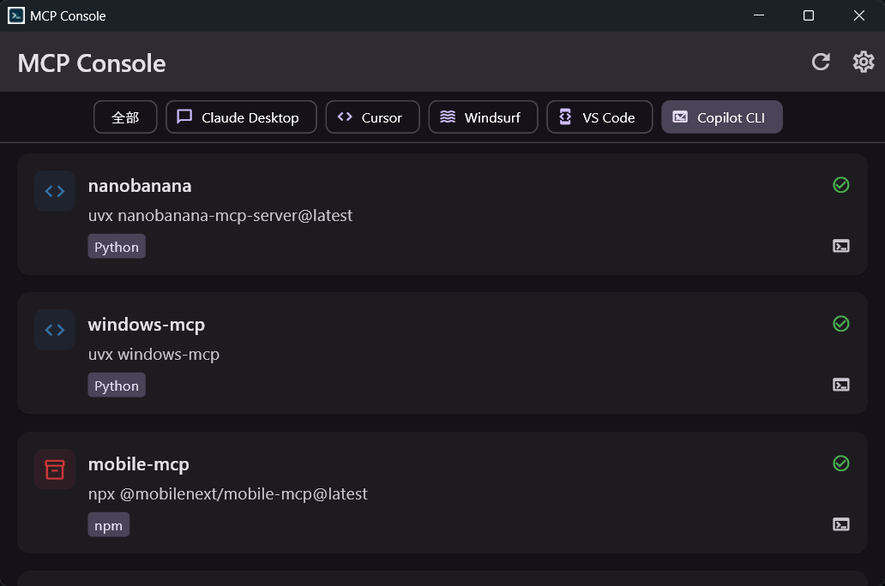

# MCP Console

[](https://github.com/JiaDians/MCP-Console/actions/workflows/ci.yml)
[](https://github.com/JiaDians/MCP-Console/releases)
[](LICENSE)

MCP Console 是一款 Windows 桌面應用程式，用於管理已安裝的 [MCP（Model Context Protocol）](https://modelcontextprotocol.io/) 伺服器。

## 下載

前往 [Releases](https://github.com/JiaDians/MCP-Console/releases) 下載最新版本：

| 檔案 | 說明 |
|------|------|
| `MCP_Console_*_Setup.exe` | **建議** — 安裝程式，含桌面捷徑 |
| `MCP_Console_*_windows_portable.zip` | 免安裝攜帶版 |

> **系統需求**：Windows 10 / 11 (x64)

### ⚠️ Windows SmartScreen 警告

首次執行時 Windows 可能顯示「Windows 已保護您的電腦」藍色警告。這是因為應用程式尚未取得程式碼簽名憑證，屬於開源軟體的常見情況。

**跳過方式**：點擊「**更多資訊**」→「**仍要執行**」即可。

## 預覽



## 功能

- **多用戶端支援**：自動讀取 Claude Desktop、Cursor、Windsurf、Cline、VS Code、Zed 等主流 AI 用戶端的設定檔
- **版本偵測**：自動查詢 npm / PyPI / GitHub 取得最新版本，並與本機已安裝版本比對
- **一鍵更新**：支援透過 `npm`、`uvx`、`pip` 等工具直接更新 MCP 伺服器
- **移除 MCP**：從一個或多個用戶端設定檔中移除指定 MCP
- **完整 MCP 規範支援**：stdio（command/args/env）及 SSE / Streamable HTTP（url/headers）兩種傳輸類型
- **中文介面**：全介面繁體中文

## 支援的 AI 用戶端

| 用戶端 | 設定檔路徑 |
|--------|-----------|
| Claude Desktop | `%APPDATA%\Claude\claude_desktop_config.json` |
| Cursor | `%APPDATA%\Cursor\User\globalStorage\saoudrizwan.claude-dev\settings\cline_mcp_settings.json` |
| Windsurf | `%APPDATA%\Windsurf\User\globalStorage\saoudrizwan.claude-dev\settings\cline_mcp_settings.json` |
| Cline (VS Code) | `%APPDATA%\Code\User\globalStorage\saoudrizwan.claude-dev\settings\cline_mcp_settings.json` |
| VS Code (Copilot) | `%APPDATA%\Code\User\settings.json` |
| Zed | `%APPDATA%\.config\zed\settings.json` |

## 開發環境需求

- Flutter 3.x（Windows 桌面支援）
- Dart SDK 3.x

## 執行方式

```bash
flutter run -d windows
```

## 建置

```bash
flutter build windows
```
